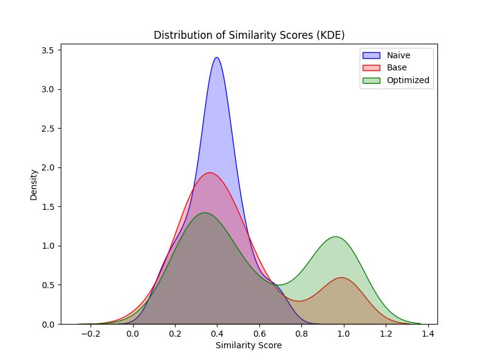

# Performant Agentic Framework: Alignment First LLM Agentic Workflow

Arena experiment code for Performant Agentic Framework (PAF), including the dataset.
Paper link: https://arxiv.org/abs/2503.06410v1

# Quick Start Demo

Create a .env file at the top level, add "OPENAI_API_KEY"

To use the dataset to generate Golden vs. Response Dataset, run

```bash
python -m data.generator
```

To use the evaluation script, run

```bash
python main.py
```

To view the statistical results, run
```bash
python stat_proof.py
```

# Table of Contents

This is a table of contents for your project. It helps the reader navigate through the README quickly.

- [Quick Start Demo](#quick-start-demo)
- [Table of Contents](#table-of-contents)
- [Installation](#installation)
- [Usage](#usage)
- [Results](#results)
- [Contribute](#contribute)
- [License](#license)

# Installation

[(Back to top)](#table-of-contents)

1. To install the repo, run:

```shell
git clone https://github.com/wayne-wang-1119/performant-agentic-framework.git
```

2. Install the required packages

```bash
brew install python@3.12
python3 -m pip install virtualenv
```

Clone the repository and `cd` into the repository

```bash
virtualenv venv
source venv/bin/activate
pip install -r requirements.txt
```

# Usage

[(Back to top)](#table-of-contents)

You can leverage the PAF repo to: 1. Generate synthetic data that can be used to evaluate Agentic Performance in a simulated live environment, or 2. Run evaluation scripts to benchmark different methods of navigating through a logic tree and see the results of Agent performance.

1.  Generate the dataset

```bash
python -m data.generator
```

This will generate a dataset in the `data` folder called dataset.csv with the following columns:

- `SystemPrompt`: The system prompt used in the experiment containing the Node navigation map with a simplified version of Agentic logic framework
- `Conversation History`: The conversation history of the user and the Agent, conversation turn back and forth generated by `/data/generator`.py
- `Golden Response`: The perfect response that the Agent should respond with, generated first by the LLM then audited by Human Evaluation one by one to ensure the quality of the golden response. This is the benchmark for truthfulness and contextual awareness of the Agentic System.

2. Run the experiment, gather the statistics:

```bash
python main.py
python stat_proof.py
```

To run individual evaluation scripts:
We leverage score / semantic similarity to the alignment of the latest generation to the golden response.

- `evaluation/eval_naive`: This script will evaluate the performance of the naive setup, which always sends the entire map and receives the entire response.

Example:

```bash
python -m evaluation.eval_naive
```

The same goes for the other evaluation scripts

# Results

[(Back to top)](#table-of-contents)


1. CSV Results: data/cross_eval.csv

[Cross Eval Dataset](./data/cross_eval.csv)

Contains cross-evaluation statistics of the Agent's responses against the Golden responses. The key metric is `total_complete_hit` which indicates a similarity score above 0.97, and the total number of `counte_above_0.8`, which indicates the conversation adheres to the guardrail with high frequency. 

2. Graphical Results: data/similarity_distributions.png



A visualization of similarity distributions between the Agent's responses and the Golden responses across three different approaches.

High Level Statistics: results.txt

[Cross Eval Stats](./results.txt)

Contains a summary of the experiment results, using paired T-test we found t-statistics and p-val.


# Contribute

[(Back to top)](#table-of-contents)

Feel free to contribute to our project

# License

[(Back to top)](#table-of-contents)

[MIT license](./LICENSE)
